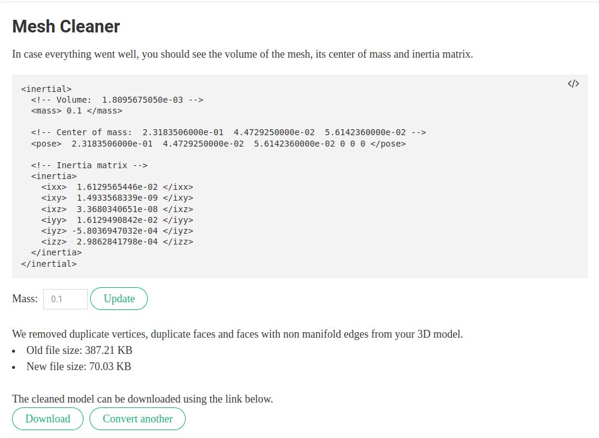
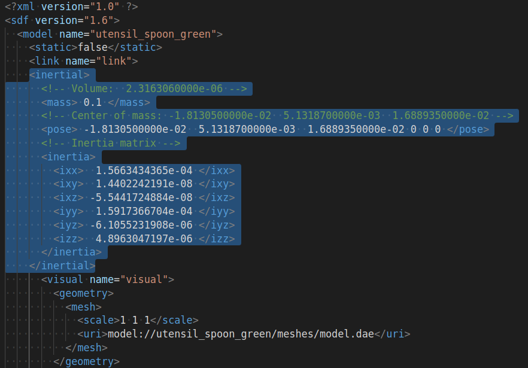
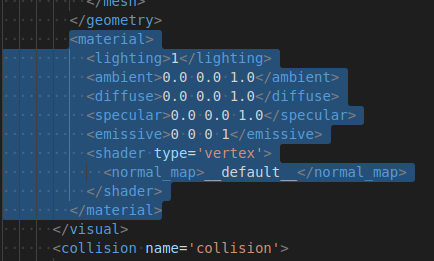

# SDF_Generator

This project is forked from [Gazebo-models-generator](https://github.com/TurtleZhong/Gazebo-models-generator). Thanks for the author's efforts.

**SDF_Generator** is for generating 3D object models (*sdf) in Gazebo with taking *.obj / *.dae as input. Different from Gazebo-models-generator, SDF_Generator is able to preprocess mesh file, and to automatically handle *.dae files. 

❤️ ❤️ ❤️ If one does not want to build SDF models, he/she can freely download models from my another project [SDF_Models](https://github.com/yding25/SDF_models).

**SDF_Generator** consists of three steps:
- ✨✨✨ **Step 1**: Download mesh file (*.obj/*dae) of an object. Here are some sources: 
    - [turbosquid](https://www.turbosquid.com/)
    - [cgtrader](https://www.cgtrader.com/)
    - [free3d](https://free3d.com/)
    - [3dwarehouse](https://3dwarehouse.sketchup.com/)
    - [gazebosim](https://app.gazebosim.org/fuel/models)
    - [sketchfab](https://sketchfab.com/feed)
  
  **!!!** Note that softwares (e.g., [Blender](https://www.blender.org/) and [Sketchup](https://www.sketchup.com/)) can convert other formats (*.3DS) into *.obj / *dae. Here, details are skipped.

<br>

- ✨✨✨ **Step 2**: Clean mesh files using [Mesh Cleaner](https://www.hamzamerzic.info/mesh_cleaner/), and download the new mesh files.
  
<p align="center">
  <a href="">
    
  </a>
</p>

<br>

- ✨✨✨ **Step 3**: Convert mesh files to *SDF using scripts
```bash
git clone https://github.com/yding25/SDF_Generator.git
cd SDF_Generator
python sdf_generator.py --model_name=YOUR_MODEL_NAME
```
**!!!** Note that **YOUR_MODEL_NAME** is from YOUR_MODEL_NAME.obj or YOUR_MODEL_NAME.dae downloaded from Mesh Cleaner.

<br>

- ✨✨✨ **Step 4**: Process the generated *.SDF file to enable object's physics. One can also skip this step if you don't need a physical object.
  - 🔥 by changing ```<static>true</static>``` to ```<static>false</static>```
  - 🔥 by adding the inertia matrix (obtained in Step 2: Mesh Cleaner)
      <p align="left">
        <a href="">
          
        </a>
      </p>
  - 🔥 by adding the color (e.g. blue)
      <p align="left">
        <a href="">
          
        </a>
      </p>
  - 🔥 by adding the collision info
      <p align="left">
        <a href="">
          
        </a>
      </p>

```bash
<material>
  <lighting>1</lighting>
  <ambient>0.0 0.0 1.0</ambient>
  <diffuse>0.0 0.0 1.0</diffuse>
  <specular>0.0 0.0 1.0</specular>
  <emissive>0 0 0 1</emissive>
  <shader type='vertex'>
    <normal_map>__default__</normal_map>
  </shader>
</material>
```
```bash
<collision name='collision'>
  <laser_retro>0</laser_retro>
  <max_contacts>10</max_contacts>
  <pose frame=''>0 0 0 0 0 0</pose>
  <geometry>
    <mesh>
      <uri>model://utensil_fork_blue/meshes/fork.dae</uri>
      <scale>1 1 1</scale>
    </mesh>
  </geometry>
</collision>
```

<br>

- ✨✨✨ **Step 5**: Move/Copy *SDF to ~/.gazebo/models/
